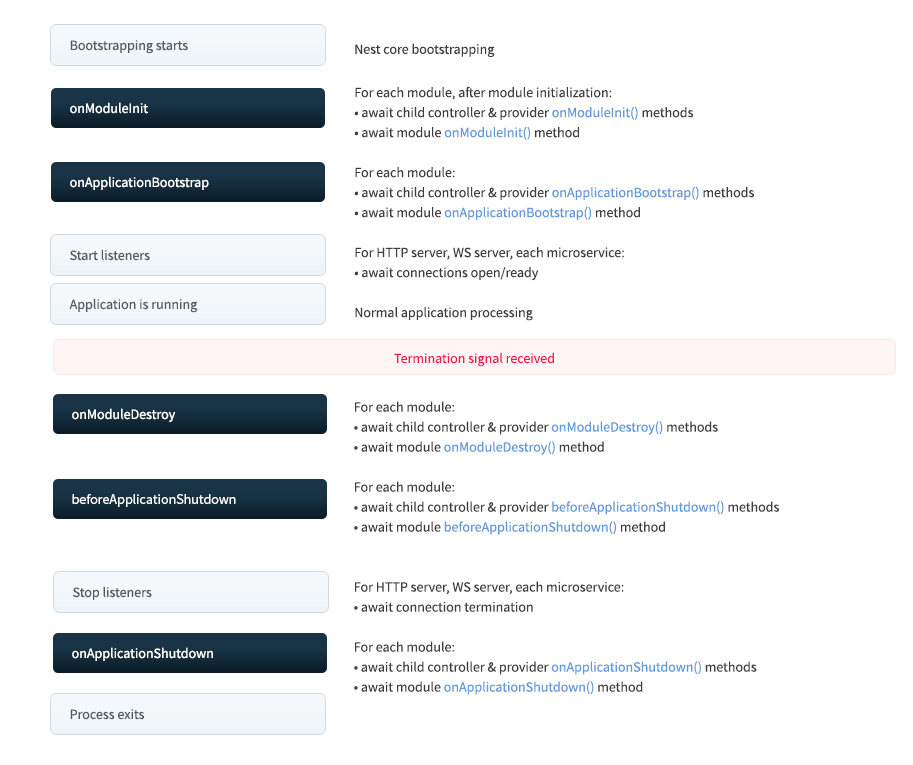
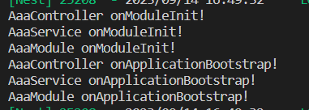

Nest 在启动的时候，会递归解析 Module 依赖，扫描其中的 provider、controller，注入它的依赖。

全部解析完后，会监听网络端口，开始处理请求。

这个过程中，Nest 暴露了一些生命周期方法：

# 应用创建时的生命周期

Bootstrapping starts

onModuleInit: 递归初始化模块，在每个模块初始化之后，依次调用模块内的 controller、provider 的 onModuleInit 方法，再调用 module 的 onModuleInit 方法。

onApplicationBootstrap: 全部初始化之后，依次调用模块内的 controller、provider 的 onApplicationBootstrap 方法，再调用 module 的 onApplicationBootstrap 方法。

Start listeners: 监听网络端口

Application is running: nest 应用正常运行。

# 应用销毁时的生命周期

先调用每个模块的 **controller、provider** 的 **onModuleDestroy** 方法，然后调用 **Module** 的 **onModuleDestroy** 方法。

之后再调用每个模块的 **controller、provider** 的 **beforeApplicationShutdown** 方法，然后调用 **Module** 的 **beforeApplicationShutdown** 方法。

然后停止监听网络端口。

之后调用每个模块的 **controller、provider** 的 **onApplicationShutdown** 方法，然后调用 **Module** 的 **onApplicationShutdown** 方法。

之后停止进程。

**beforeApplicationShutdown 是可以拿到 signal 系统信号的，如 SIGTERM。**