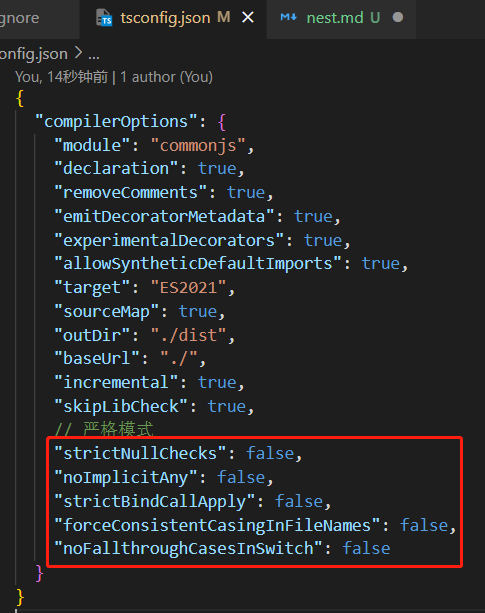
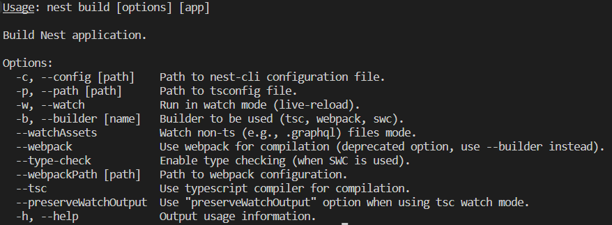

<!--
 * @Author: CuiXiang xiang.cui@modeling-tech.com
 * @Date: 2023-08-30 10:19:53
 * @LastEditors: CuiXiang xiang.cui@modeling-tech.com
 * @LastEditTime: 2023-09-04 11:28:08
 * @FilePath: \nest-demo\md\nest.md
 * @Description: nest.js 相关笔记
-->

# 起步

1. 全局安装 Nest CLI。 `npm install -g @nestjs/cli`
2. nest new。

# nest 命令

command overview：

## nest new 快速创建项目

1. --skip-git 和 --skip-install，跳过 git 初始化、跳过 npm install。
2. --package-manager。指定包管理器，如`nest new xxx -p npm/yarn/pnpm`。
3. --language 指定 ts 或 js。默认 ts。
4. --strict。ts 的编译选项是否开启严格模式，有五个选项：
   
5. --collection。涉及到 nest generate。

## nest generate 快速生成代码

快速生成各种代码。

1. --flat 和 --no-flat 是指定是否生成对应目录的。
2. --spec 和 --no-spec 是指定是否生成测试文件。
3. --skip-import 是指定不在 AppModule 里引入。

## nest build 使用 tsc 或 webpack 构建代码

构建项目，会在 dist 目录下生成编译后的代码。

1. --wepback 和 --tsc 是指定用什么编译，默认是 tsc 编译，也可以切换成 webpack。
2. --watch 是监听文件变动，自动 build 的。默认只是监听 ts、js 文件，加上 --watchAssets 会连别的文件一同监听变化，并输出到 dist 目录，比如 md、yml 等文件。
3. --path 是指定 tsc 配置文件的路径的。
4. --config 指定 nest cli 的配置文件。以上配置都可以在 nest-cli.json 里配置。

## nest start 启动开发服务

1. --watch 改动文件之后自动重新 build。
2. --debug 启动调试的 websocket 服务，用于 debug。
3. --exec 指定用什么来跑，默认 node，也可以切换别的 runtime。

## nest info

查看项目信息，包括系统信息、node、npm 和依赖版本。